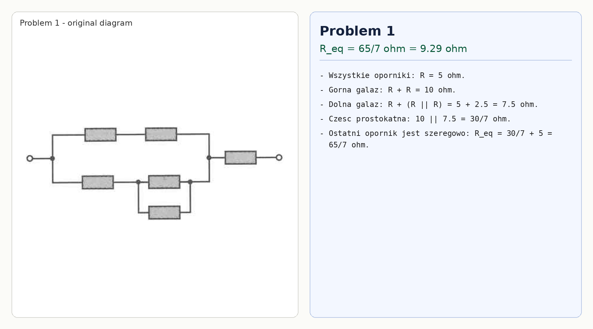

# Problem 1

All resistors have resistance $R=5\,\Omega$.

Top branch: $R+R=10\,\Omega$.

Bottom branch: $R+(R\parallel R)=5+2.5=7.5\,\Omega$.

The rectangular part is therefore

$$R_p=10\parallel 7.5=\frac{10\cdot 7.5}{10+7.5}=\frac{30}{7}\,\Omega.$$

The resistor on the right is in series:

$$R_{eq}=\frac{30}{7}+5=\frac{65}{7}\,\Omega\approx 9.29\,\Omega.$$

