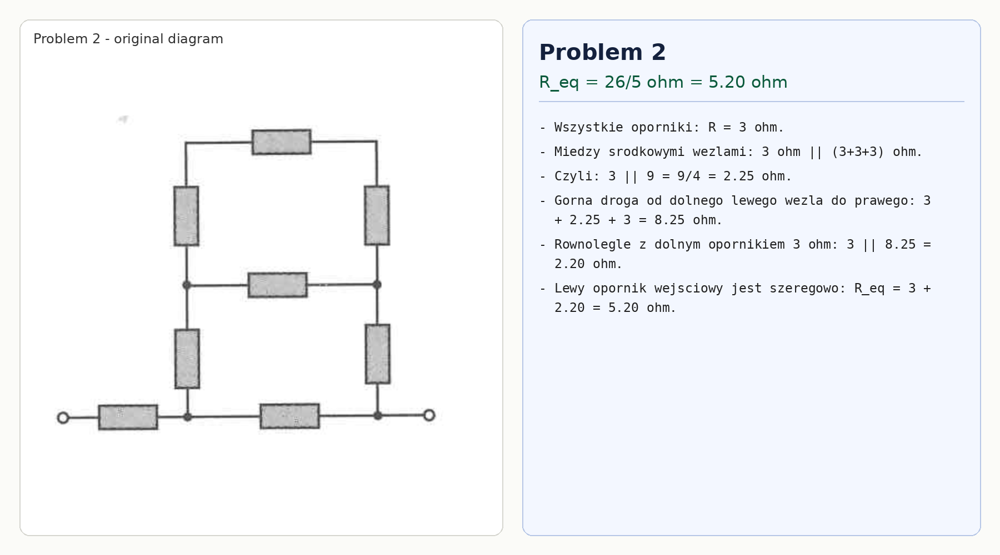

# Problem 2

All resistors have resistance $R=3\,\Omega$.

Between the two middle nodes there are two paths: the middle resistor $3\,\Omega$ and the upper chain $3+3+3=9\,\Omega$. Hence

$$R_m=3\parallel 9=\frac{9}{4}=2.25\,\Omega.$$

The upper route between the lower left and lower right nodes is

$$3+2.25+3=8.25\,\Omega.$$

This is in parallel with the bottom resistor $3\,\Omega$:

$$R_p=3\parallel 8.25=2.20\,\Omega.$$

The left input resistor is in series, so

$$R_{eq}=3+2.20=5.20\,\Omega=\frac{26}{5}\,\Omega.$$

