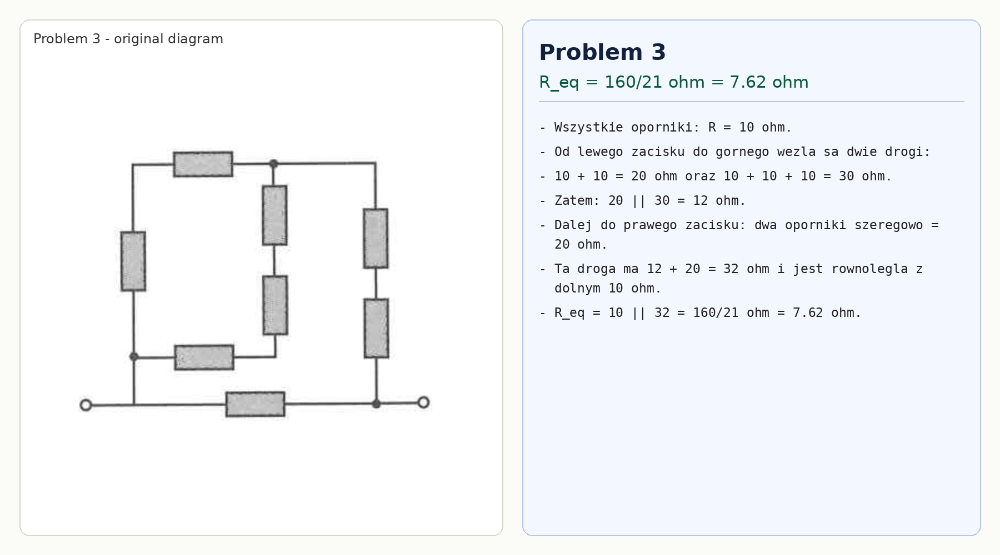

# Problem 3

All resistors have resistance $R=10\,\Omega$.

From the left terminal to the top node there are two parallel routes:

$$10+10=20\,\Omega,$$

$$10+10+10=30\,\Omega.$$

Thus

$$R_{left-top}=20\parallel 30=12\,\Omega.$$

From the top node to the right terminal the right branch has two series resistors, so $20\,\Omega$. This whole route is $12+20=32\,\Omega$, in parallel with the bottom resistor $10\,\Omega$:

$$R_{eq}=10\parallel 32=\frac{160}{21}\,\Omega\approx 7.62\,\Omega.$$

