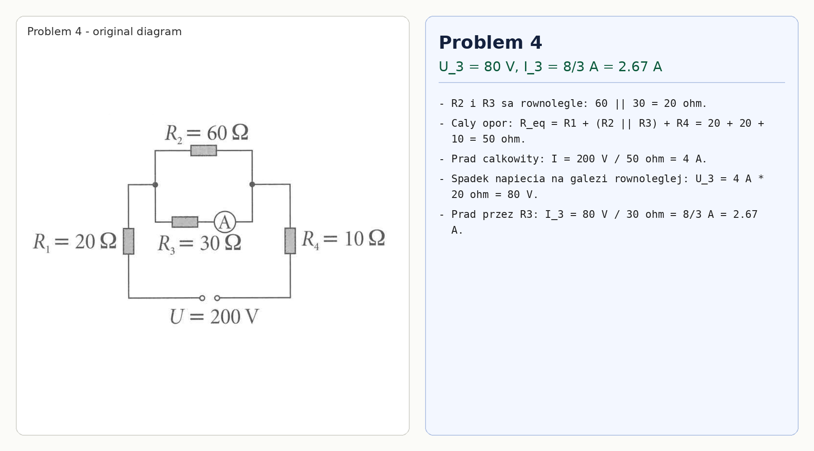

# Problem 4

Resistors $R_2$ and $R_3$ are in parallel:

$$R_{23}=60\parallel 30=20\,\Omega.$$

The total resistance is

$$R_{eq}=R_1+R_{23}+R_4=20+20+10=50\,\Omega.$$

The total current is

$$I=\frac{200}{50}=4\,\text{A}.$$

The voltage across the parallel part, and therefore across $R_3$, is

$$U_3=I R_{23}=4\cdot 20=80\,\text{V}.$$

Thus

$$I_3=\frac{U_3}{R_3}=\frac{80}{30}=\frac{8}{3}\,\text{A}\approx 2.67\,\text{A}.$$

