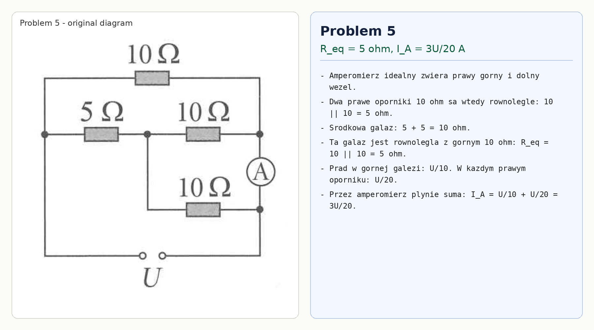

# Problem 5

Assume an ideal ammeter. It short-circuits the upper and lower right nodes. Therefore the two right-hand $10\,\Omega$ resistors are in parallel:

$$10\parallel 10=5\,\Omega.$$

The middle route is then

$$5+5=10\,\Omega.$$

This route is in parallel with the top $10\,\Omega$ resistor, so

$$R_{eq}=10\parallel 10=5\,\Omega.$$

If the source voltage is $U$, the top branch current is $U/10$. The current through the upper right $10\,\Omega$ resistor is $U/20$. Both meet at the upper ammeter node, so

$$I_A=\frac{U}{10}+\frac{U}{20}=\frac{3U}{20}\,\text{A}.$$

