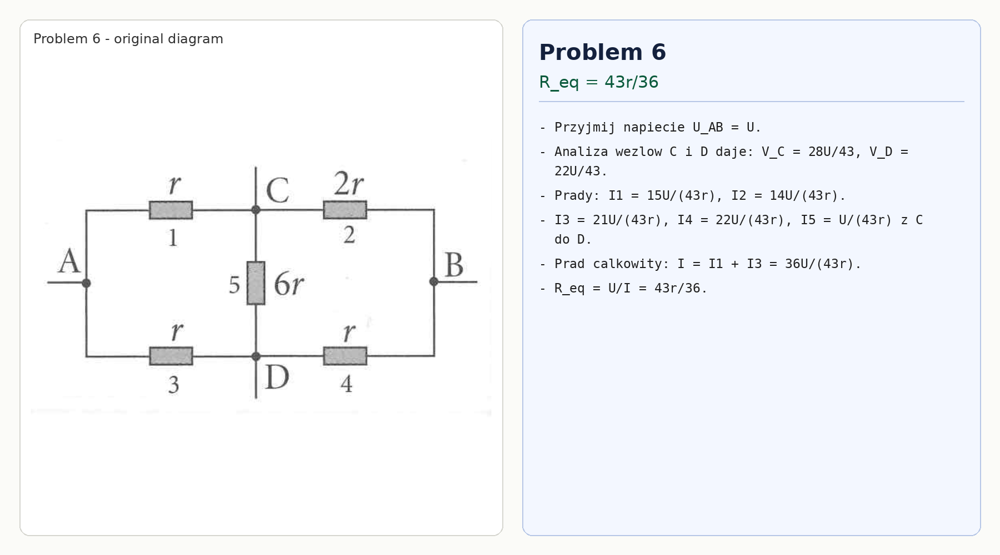

# Problem 6

Let $U_{AB}=U$. Using node potentials at $C$ and $D$ gives

$$V_C=\frac{28U}{43},\qquad V_D=\frac{22U}{43}.$$

The currents through the resistors are

$$I_1=\frac{U-V_C}{r}=\frac{15U}{43r},$$

$$I_2=\frac{V_C}{2r}=\frac{14U}{43r},$$

$$I_3=\frac{U-V_D}{r}=\frac{21U}{43r},$$

$$I_4=\frac{V_D}{r}=\frac{22U}{43r},$$

$$I_5=\frac{V_C-V_D}{6r}=\frac{U}{43r}.$$

The current through resistor 5 flows from $C$ to $D$. The total current is

$$I=I_1+I_3=\frac{36U}{43r},$$

so

$$R_{eq}=\frac{U}{I}=\frac{43r}{36}.$$

