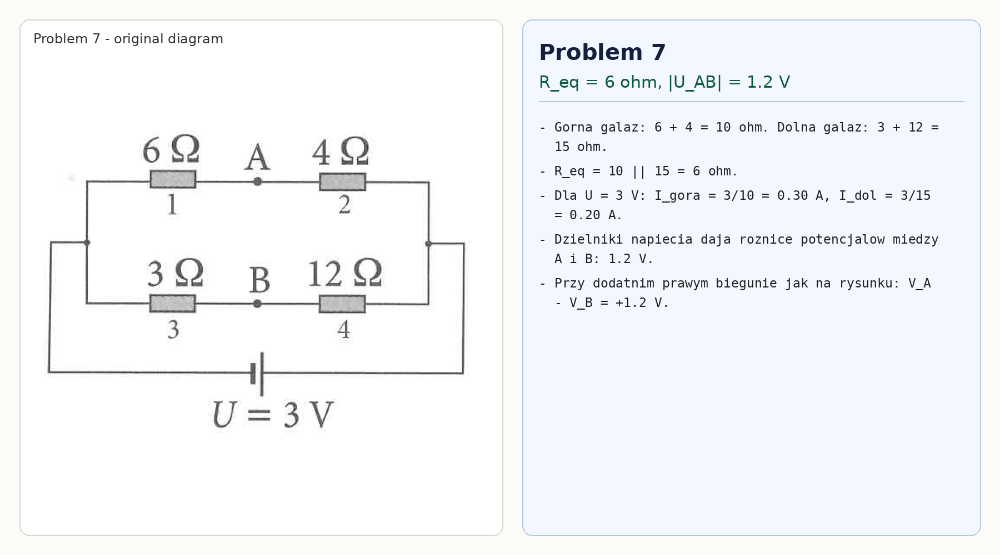

# Problem 7

The top branch has

$$6+4=10\,\Omega,$$

while the bottom branch has

$$3+12=15\,\Omega.$$

Therefore

$$R_{eq}=10\parallel 15=6\,\Omega.$$

For $U=3\,\text{V}$:

$$I_{top}=\frac{3}{10}=0.30\,\text{A},\qquad I_{bottom}=\frac{3}{15}=0.20\,\text{A}.$$

The voltage dividers place points $A$ and $B$ at potentials differing by

$$|U_{AB}|=1.2\,\text{V}.$$

With the right terminal treated as the positive terminal as drawn,

$$V_A-V_B=+1.2\,\text{V}.$$

