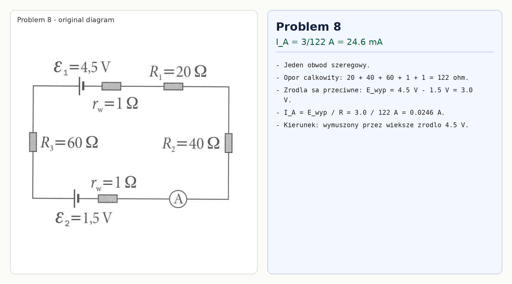

# Problem 8

This is one series loop. The total resistance, including internal resistances, is

$$R=20+40+60+1+1=122\,\Omega.$$

The two sources oppose each other, so the effective emf is

$$\mathcal E=4.5-1.5=3.0\,\text{V}.$$

Thus the ammeter current is

$$I_A=\frac{3.0}{122}=0.0246\,\text{A}=24.6\,\text{mA}.$$

The direction is set by the stronger $4.5\,\text{V}$ source.

