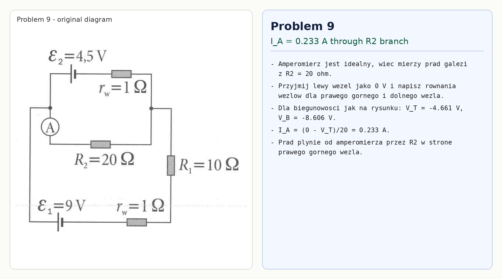

# Problem 9

Assume ideal ammeter resistance. It measures the current in the branch with $R_2=20\,\Omega$.

Take the left node as $0\,\text{V}$. With the source polarities shown in the diagram, nodal analysis for the upper-right node $T$ and lower-right node $B$ gives

$$V_T=-4.661\,\text{V},\qquad V_B=-8.606\,\text{V}.$$

Therefore the ammeter current is

$$I_A=\frac{0-V_T}{20}=0.233\,\text{A}.$$

It flows through the ammeter into the $R_2$ branch, toward the upper-right node.

