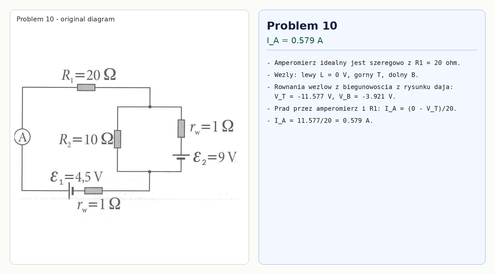

# Problem 10

Assume an ideal ammeter. It is in series with $R_1=20\,\Omega$, so it measures the current through $R_1$.

Take the left node as $0\,\text{V}$, and call the upper and lower right nodes $T$ and $B$. With the source polarities shown in the diagram, nodal analysis gives

$$V_T=-11.577\,\text{V},\qquad V_B=-3.921\,\text{V}.$$

Hence

$$I_A=\frac{0-V_T}{20}=\frac{11.577}{20}=0.579\,\text{A}.$$

